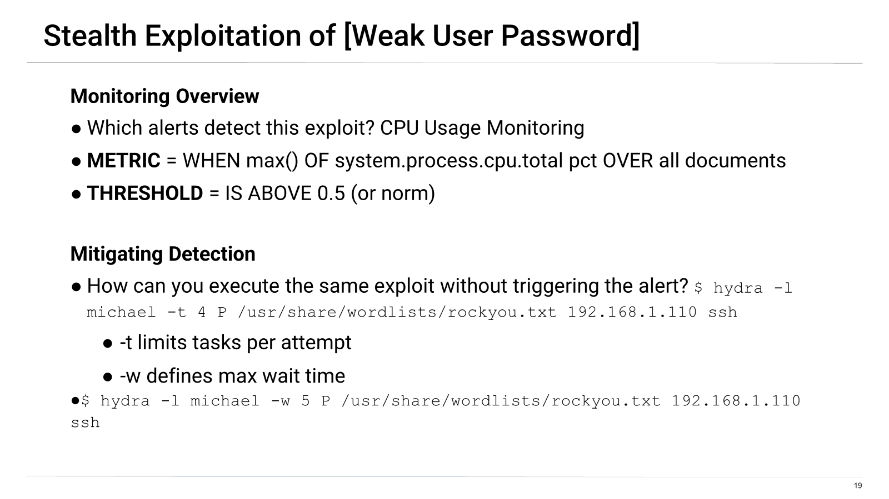

# SIEM_SOC
# Supporting SOC infrastructure - Combining offensive security, defensive security, and network analysis.

[comment]: # (this is the syntax for a comment)

This project is organized into the following sections and subsections:
- **Network Topology:** Live network environment
    - Host machine
    - Attacking machine
    - Vulnerable Web Server
    - Wordpress Target
    - ELK Server
- **Offensive Security:** Security assessment of vulnerable VM and verification of working Kibana rules.
    - Critical Vulnerabilities
    - Exploits Used
    - Avoiding Detection
    - Maintaining Access   
- **Defensive Security:** Creating and implementing alerts and thresholds
    - Alerts Implemented
    - Hardening
    - Implementing Policies
- **Network Analysis:** Network forensics and analysis
    - Traffic Profile
    - Normal Activity
    - Malicious activity
___

In this activity SIEM engineers conduct offensive, defensive, and network analysis acivities to provide the SOC team with a comprehensive security report. Approaching potential cybersecurity threats from multiple perspectives is likely to provide a more complete threat analysis. 

## Network Topology

In this environment the Kali Linux machine is the attacking machine. The ELK server is monitoring the vulnerable target machines as the attacking machine seeks to exploit the system.  

## Offensive Security

The objective of the offensive SIEM engineering team is to identify critical vulnerabilities in the system and exploit them. Documention of these vulnerabilities is reported to the SOC team. 

**Critical Vulnerabilities**

Our assessment uncovered the following critical vulnerabilities

    - Poorly secured ssh port
    - SQL enumeration
    - Weak user password
    - No file security

***Exploitation - Poorly Secured SSH Port***

What tool or technique did you use to exploit the vulnerability?
>nmap port scanning

`nmap -O 192.168.1.0/24`

What did the exploit achieve?
>Unauthorized access to the Target 1 machine was achieved by using the unsecured ssh port identified on the vulnerable machine.
>Identification of vulnerable ports to potentially gain unauthorized access to the "Target 1" system.

`ssh Michael@192.168.1.110`

***Exploitation - WordPress Susceptible to Enumeration***

What tool or technique did you use to exploit the vulnerability?
>WPScan enumeration

`wpscan --url 192.168.1.110/wordpress -e u`

 
What did the exploit achieve?
>Acquisition of usernames and their associated IP addresses.

***Exploitation - Weak User Password***

What tool or technique did you use to exploit the vulnerability?
>Brute forcing passwords using hydra

`$ hydra -l michael -t 4 -P /usr/share/wordlists/rockyou.txt 192.168.1.110 ssh`

What did the exploit achieve?
>Discovered the login password for user “michael” allowing ssh access into Target 1 Machine

 

***Exploitation - No File Security***

What tool or technique did you use to exploit the vulnerability?
>Simple directory exploration.

What did the exploit achieve?
>Privelege escalation - login data granted root access to Target 1 mysql data

`michael@target1:/var/www/html/wp-config.php`

**Avoiding Detection**

Identifying the key data points and understanding how monitoring system alerts are generated helps the offensive SIEM engineer avoid detection. This expands the scope of potential system vulnerabilities. 

Monitoring - Identify alerts, metrics, and thresholds 

Mitigation - How can you execute the same exploit without triggering the alert? Are there alternative exploits that may perform better? 
 
 

**Stealth Exploitation of Poorly Secured SSH Port**

    - Monitoring Overview
        - Alerts that detect this exploit:
		  - Port scanning traffic alerts
		  - Alerts monitoring for Unauthorized access through ssh port
        - Metric = `WHEN sum () of http.request.bytes OVER all documents`
        - Threshold = `IS ABOVE 3500 FOR THE LAST 1 minute`

    - Mitigation Detection
        - How can you execute the same exploit without triggering the alert? 
		  - Stealth scan
		  - Fast scan
		  - Limited-time scan
Stealth scan:
`nmap -sS`

 

Fast scan:
`nmap -F`

**Stealth Exploitation of WordPress Susceptible to Enumeration**

    - Monitoring Overview
        - Alerts that detect this exploit:
		  - Alerts monitoring traffic from suspicious sources.
		  - Alerts monitoring traffic from non-white-listed IPs.
        - Metric = `WHEN count() GROUPED OVER top 5 ‘http.response.status_code`
        - Threshold = `IS ABOVE 400`

    - Mitigation Detection
        - How can you execute the same exploit without triggering the alert?
		  - Scan a WordPress site using random user agents and passive detection.
`wpscan --url 192.168.1.110/wordpress --stealthy -e u`
		

**Stealth Exploitation of Weak User Password**

    - Monitoring Overview
        - Alerts that detect this exploit: CPU Usage Monitoring
		  - Alerts monitoring abnormal CPU usage according to time.
		  - Alerts monitoring abnormally high CPU usage.
        - Metric = `WHEN max() OF system.process.cpu.total pct OVER all documents`
        - Threshold = `IS ABOVE 0.5` (or norm for company)

    - Mitigation Detection
        - How can you execute the same exploit without triggering the alert? 
`$ hydra -l michael -t 4 P /usr/share/wordlists/rockyou.txt 192.168.1.110 ssh`
  - -t limits tasks per attempt
`$ hydra -l michael -w 5 P /usr/share/wordlists/rockyou.txt 192.168.1.110 ssh`
  - -w defines max wait time
  
 

**Stealth Exploitation of No File Security**

    - Monitoring Overview
        - Alerts that detect this exploit: Alerts monitoring traffic from;
		  - suspicious/malicious sources
		  - non-white-listed IPs
		  - unauthorized accounts
		  - root user logins
        - Metric = `user.name: root AND source.ip: 192.168.1.90 AND destination.ip: 192.168.1.110 OR event.action: ssh_login OR event.outcome: success`
        - Threshold = `IS ABOVE 1`

    - Mitigation Detection
        - How can you execute the same exploit without triggering the alert? 
		  - Remove evidence of instrusion/unauthorized access
		  - Mask source IP
		- Are there alternative exploits that may perform better? If attempts to elevate privileges to sudo are restricted and if root login data is secured with up-to-date password hashes, malicious actors will have a much more difficult time gaining root or elevated permissions.

 

**Maintaining Access**
Maintain access by writing a script to add an unauthorized user to the target system.

Python Script to Add User
`sudo python -c 'import.pty;pty.spawn("/bin/bash")'`
 

 
Could also write a script to install a backdoor shell listening for the attacker's instructions.

## Defensive Security

The objective is to configure Kibana alerts and make sure they are working correctly. Here we ensure the latest exploits and vulnerabilities are accounted for.

**Alerts Overview**

When generating alerts it can be helpful to identify
    - the metric that the alert monitors
    - the threshold that metric fires at
	
 [S28]

**Alert: CPU Usage Monitor**

 [S27_a]

**Alert: Excessive HTTP Errors**

 [S30]

**Alert: HTTP Request Size Monitor**

 [S31]

**Hardening**
Effective hardening methods should explain
    - how to patch a target against the vulnerabilities
    - why the patch works and how to install the patch

**Hardening Against on Target 1**

 [S34]

**Hardening Against on Target 1**

 [S35]

**Hardening Against on Target 1**

  [S36_c]

**Implementing Patches with Ansible**
Explain the vulnerability each task in the playbook addresses

## Network Analysis

The objective is to analyze network traffic to identify suspicious or malicious activity.

**Traffic Profile and Behavioral Analysis**

 

**Normal Activity**
***Normal Activity - Web Traffic***

Kind of Traffic - Web traffic
Protocol - HTTP
Specific user action - Browsing "orbike.com"
Screenshots of packets justifying conclusions - 

Description of any interesting files - 

***Normal Activity - DNS***

Kind of Traffic - DNS query for "orbike.com"
Protocol - UDP over port 53;8.8.8.8
Specific user action - Querying Google DNS servers for "orbike.com" site data 
 
Packet data justifying conclusions - 
 

**Malicious Activity**
***Malicious Activity - Time Thieves*** 

Kind of Traffic - 
Protocol - 
Specific user action - 
Packet data justifying conclusions - 

Users created a web server to access YouTube

  - Filtered for traffic by IP address to correlate users and IP addresses.

  - Discovered web server domain name "frank-n-ted.com"  and IP address 10.6.12.12

***Malicious Activity - Malicious File Download*** 

Kind of Traffic - 
Protocol - 
Specific user action - 
Packet data justifying conclusions -    

 
 
The malicious file was downloaded on machine IP Address 10.6.12.203
`june11.dll`

"june11.dll" was scanned by anti-malware software "VirusTotal" and flagged as a possible Trojan
 

***Malicious Activity - Vulnerable Windows Host Machines Infected***
Kind of Traffic - 
Protocol - 
Specific user action - 
Packet data justifying conclusions - 

Infected host machine on network
 

***Malicious Activity - Illegal Downloads*** 
Kind of Traffic - 
Protocol - 
Specific user action - 
Packet data justifying conclusions - 

 

## Works Cited ##

`THIS TEXT IS IN CODE FORMAT`
